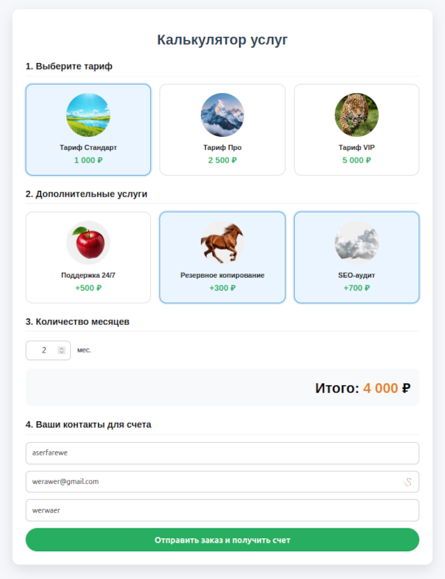
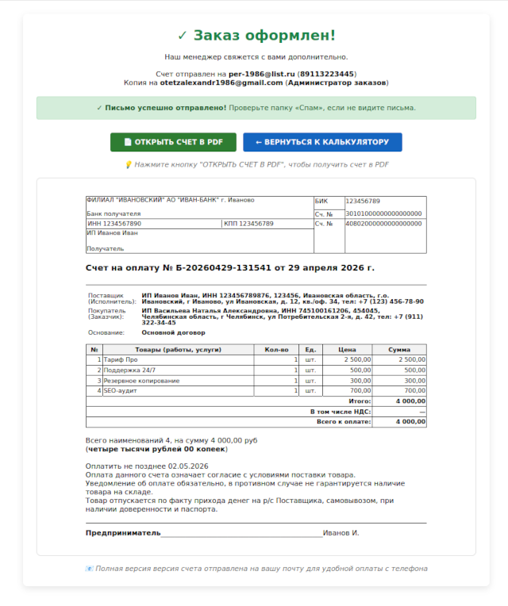
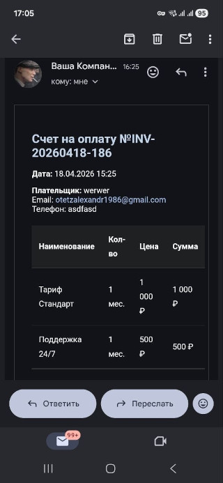
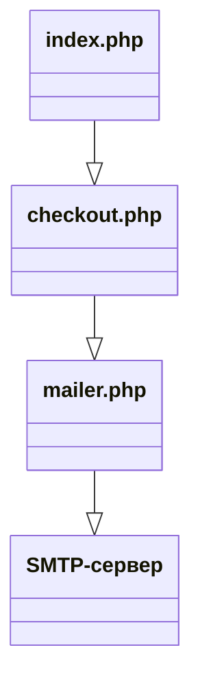

<div align="center">
  <a id="russian"></a>
  <h1>Скрипт php: Калькулятор-заказа с отправкой счёта на оплату</h1>

  
  
  
  
  
</div>

  > **Author:** Alexandr Anatoliev

  > **GitHub:** [AlexandrAnatoliev](https://github.com/AlexandrAnatoliev)

---

<div align="center">
  <h2>Навигация</h2>
</div>

* [Техническое задание](#technical-specifications)
* [Общая архитектура](#architecture)
* [Требования к серверу](#requirements)
* [Установка PHPMailer](#PHPMailer-install)
* [Настройка почтового сервиса](#mail-service-setup)
* [Настройки товаров](#index-setting)
* [Переменные окружения](#env)

---

<div align="center">
  <a id="technical-specifications"></a>
  <h2>Техническое задание</h2>
</div>

```
Нужен скрипт калькулятора-заказа на php с радиокнопками, чекбоксами, 
картинками, полем ввода количества, расчётом итоговой суммы заказа 
и отправкой готового счета на оплату(в pdf или html с возможностью 
сохранения покупателем из письма в pdf) на почту покупателя и админа. 
Проведение онлайн оплаты не нужно, только отправка.
```

### Чек-лист требований

#### 1. Общая информация

* **Цель:** Скрипт на PHP для оформления заказа (калькулятор) с отправкой счёта на оплату.
* **Оплата онлайн:** Не требуется. Проводится оффлайн по сформированному счёту.
* **Хостинг:** [hostia.net](http://hostia.net) (особенность: только файловый менеджер, нет доступа к консоли).
* **Пользователи:** Покупатель (фронтенд) и Администратор (скрытая часть).

#### 2. Фронтенд (страница заказа) — `index.php`

##### UI/UX и верстка

* [x] **Радиокнопки** для выбора основного товара/услуги.
* [x] **Чекбоксы** для дополнительных опций.
* [ ] **Картинки** товаров/опций (фикс. ширина ~100px? Уточнить адаптивность).
  * [ ] Добавить **галочку/птичку/индикатор** в углу картинки при выборе опции (чтобы пользователи не путались).
* [x] **Поле ввода количества**.
* [ ] **Адаптивность:** Корректное отображение на мобильных и десктопе.
  * [ ] Решить вопрос с большим количеством опций (5-7+). Горизонтальный скролл с кнопками-стрелками или перенос строками?
* [x] **Расчёт итоговой суммы** динамически на странице.
* [x] **Счёт на оплату НЕ отображать** на странице. Только текстовый список выбранных позиций и общая сумма.

##### Поля ввода

* [x] Название компании/организации покупателя.
* [x] Телефон.
* [x] Email.
* [x] Поле ввода количества товара.
* [ ] **Валидация:**
  * [ ] Проверка корректности Email.
  * [ ] Проверка корректности Телефона.
  * [ ] Убрать лимит количества в 12 шт. (сделать "макс. 99" или без лимита).

##### Кнопка действия

* [x] Кнопка «Выслать счёт на оплату на почту» (вызывает отправку письма).

##### Защита от спама

* [ ] **Капча (CAPTCHA):**
  * [ ] Простой вариант (например, математический вопрос "Сколько будет 5 + 7? Введите цифрой").
  * [ ] Rate Limiting (тайм-аут на отправку, например, 1 раз в минуту с одного IP).

#### 3. Безопасность и структура кода

##### Защита данных

* [x] **Переменные окружения:** Пароли, ключи API,
коды доступа вынесены в файл `.env`.
* [x] **Скрытие логики:** Основной рабочий код (расчеты, PDF, отправка)
не должен быть доступен для просмотра через браузер
(лежит в отдельных PHP-файлах на сервере).
* [x] Строгая типизация типов данных
  * [x] Вывод ошибок на экран при разработке
  * [x] Отключение вывода в продакшене
* [ ] **Доступ к `.env`:** Запрещен через настройки Apache (.htaccess) или права доступа.
  * [ ] Проверить возможность при пробном хостинге (через администратора)
  * [ ] Описать в документации

##### Админка (MVP)

* [ ] В первой версии — «файловая админка».
* [x] **Файл настроек `index.php`:** Комментированный код в начале файла (или отдельный простой конфиг), где администратор может сменить:
  * Картинки (пути).
  * Названия услуг.
  * Цены.
* [ ] **(Опционально в будущем):** Развитие до полноценной админки с графическим интерфейсом и входом по паролю (отдельная ссылка).

#### 4. Счёт на оплату (документ)

##### Стандарт оформления

* [x] **Бланк строгой формы**, аналогичный «1С» и принятый в документообороте РФ.
* [x] **Границы таблицы:** Чёткие рамки у всех ячеек (как в предоставленных PDF-образцах).
* [x] **Нумерация:** Формат номера с префиксом «Б». Пример: `Счёт на оплату № Б-001 от 21.04.2026 г.` (генерируется автоматически с автоинкрементом и датой).
* [x] **Шапка:** Реквизиты Продавца (подтягиваются из настроек).
* [x] **Шапка:** Реквизиты Покупателя (Название компании, телефон, email — только то, что ввел клиент).

##### Техническая реализация

* [ ] **Способ отправки:** Счёт в формате **PDF должен быть прикреплённым файлом** к письму (In-Reply-To/Attachment).
* [ ] **Конвертация:** Перед отправкой HTML-шаблон счёта преобразуется в PDF на сервере (чтобы рамки и стили сохранялись везде, включая мобильные почтовики).
* [x] **Письмо:** Приходит и Покупателю, и Администратору.

#### 5. Документация и развертывание

* [ ] **README с инструкцией:** Как развернуть (в том числе на хостинге без SSH).
* [ ] **Комментарии в коде:** Понятные пояснения на русском/английском в каждом PHP и HTML блоке.
* [ ] **Переносимость:** Скрипт легко скопировать и настроить под «другой товар» (минимальное количество правок в `index.php` / конфиге).
* [ ] **Скриншоты работы:** Актуальные скрины в репозитории (фронт, чек, письмо).

#### 6. Технический долг / Баги

* [ ] Поправить отображение чеков в почтовых клиентах (сломанные стили/рамки без конвертации).
* [ ] Настроить корректное сохранение PDF из тела письма вручную (пока проблема на телефонах).
* [ ] Протестировать на реальном хостинге Hostia (особенности файловой системы и почтового модуля).
* [ ] Убрать хардкод размера картинок (адаптивная сетка).

#### Реализовано

* Страница заказа

<div align="center">
  
</div>
* Счет на оплату:
<div align="center">
  
</div>
* Сохранение в pdf-файл:
* Отправка письма на почту покупателю:
<div align="center">
  
</div>

---

<div align="center">
  <a id="architecture"></a>
  <h2>Общая архитектура</h2>
</div>



---

<div align="center">
  <a id="requirements"></a>
  <h2>Требования к серверу</h2>
</div>

* PHP: версия 7.4 и выше
* Расширения PHP: openssl, sockets
* Composer: менеджер пакетов PHP
* Права доступа: возможность записи в папку проекта

<div align="center">
  <h3>Проверка установленных расширений</h3>
</div>

```
php -m | grep -E "openssl|sockets"
```

#### Ожидаемый вывод

```
openssl
sockets
```

<div align="center">
  <h3>Установка недостающих расширений</h3>
</div>

#### Ubuntu/Debian

```
sudo apt update
sudo apt install php-openssl php-sockets
sudo systemctl restart apache2
```

#### Windows (XAMPP)

Раскомментировать строки в `xampp\php\php.ini`:

```
extension=openssl
extension=sockets
```

---

<div align="center">
  <a id="PHPMailer-install"></a>
  <h2>Установка PHPMailer и phpdotenv</h2>
</div>

<div align="center">
  <h3>Установка Composer</h3>
</div>

#### Ubuntu/Debian

```
sudo apt update
sudo apt install composer -y
```

#### Windows (XAMPP)

Скачать установщик с **getcomposer.org**

<div align="center">
  <h3>Установка библиотек</h3>
</div>

#### Ubuntu/Debian

В корневой папке проекта выполнить:

```
composer require phpmailer/phpmailer
```

```
composer require vlucas/phpdotenv
```

После установки структура папок будет выглядеть:

```
/project/
├── checkout.php
├── configs/
│   ├── .env
│   ├── .env.example
│   ├── adminSettings.php
│   ├── bankDetailsSettings.php
│   └── mailerSettings.php
├── img/
├── index.php
├── invoice.php
├── mailer.php
├── README.md
├── styles/
│   ├── checkout.css
│   └── index.css
└── vendor
    ├── phpmailer/
    └── autoload.php
```

---

<div align="center">
  <a id="mail-service-setup"></a>
  <h2>Настройка почтового сервиса</h2>
</div>

<div align="center">
  <h3>Gmail</h3>
</div>

#### Получение пароля приложения

* Включить двухфакторную аутентификацию в Google-аккаунте:

```
Настройки → Безопасность → Двухфакторная аутентификация
```

* Создать пароль приложения:
  * myaccount.google.com/apppasswords
  * Приложение: Почта
  * Устройство: Другое (ввести "PHP Calculator")
  * Скопировать 16-значный пароль

#### Конфигурация Gmail SMTP

| Параметр           | Значение                              |
|---------------------|---------------------------------------|
| SMTP-сервер         | smtp.gmail.com                        |
| Порт               | 587 (TLS) или 465 (SSL)               |
| Шифрование         | STARTTLS (для 587) или SSL (для 465)  |
| Лимит писем/день   | 500                                   |

<div align="center">
  <h3>Яндекс Почта</h3>
</div>

#### Получение пароля приложения

* Яндекс ID → Безопасность → Пароли приложений
* Создать пароль → Выбрать "Почта"
* Скопировать пароль

#### Конфигурация Яндекс SMTP

| Параметр           | Значение        |
|---------------------|-----------------|
| SMTP-сервер         | smtp.yandex.ru  |
| Порт               | 465 (SSL)       |
| Шифрование         | SSL             |
| Лимит писем/день   | 5000            |

<div align="center">
  <h3>Mail.ru</h3>
</div>

#### Получение пароля

* Настройки → Безопасность → Пароли для внешних приложений
* Создать пароль
* Скопировать пароль

#### Конфигурация Mail.ru SMTP

| Параметр           | Значение      |
|---------------------|---------------|
| SMTP-сервер         | smtp.mail.ru  |
| Порт               | 465 (SSL)     |
| Шифрование         | SSL           |

<div align="center">
  <h3>TimeWeb</h3>
</div>

В TimeWeb закрыты некоторые порты - открывать через тех.поддержку.
  
---

<div align="center">
  <a id="index-setting"></a>
  <h2>Настройки товаров</h2>
</div>

Добавление / удаление товаров, изменение цен, картинок производится редактированием
соответствующих значений в массиве `items` в файле  `index.php`.

```
$items = [
  'standart' => ['name' => 'Тариф Стандарт', 'price' => 1000, 'img' => 'img/standart.jpg'],
  'pro'      => ['name' => 'Тариф Про', 'price' => 2500, 'img' => 'img/pro.jpg'],
  'vip'      => ['name' => 'Тариф VIP', 'price' => 5000, 'img' => 'img/vip.jpg'],
];
```

Картинки размещаются в папке `img/`

```
.
├── img
│  ├── backup.png
│  ├── checkout.png
│  ├── index.png
│  ├── phone-mail.jpg
│  ├── placeholder.jpg
│  ├── pro.jpg
│  ├── seo.png
│  ├── standart.jpg
│  ├── support.png
│  └── vip.jpg
└── index.php
```

---

<div align="center">
  <a id="env"></a>
  <h2>Переменные окружения</h2>
</div>

Проект изначально содержит образец файла конфигурации `.env.example`

```
/project/
└── configs/
    ├── .env.example
    ├── adminSettings.php
│   ├── bankDetailsSettings.php
│   └── mailerSettings.php
```

Перейдите в папку configs/

```
cd configs/
```

Переименуйте файл в .env

```
mv .env.example .env
```

```
/project/
└── configs/
    ├── .env
    ├── adminSettings.php
│   ├── bankDetailsSettings.php
│   └── mailerSettings.php
```

Раскомментируйте и присвойте свои значения переменным

```
# Это образец файла конфигурации

# =============================================================
# mailer.php 
# =============================================================

# настройки почты (обязательные)

# MAILER_USERNAME=your-email@gmail.com
# MAILER_PASSWORD=your-app-password-here

# настройки почты (опциональные)
# Если не указаны, используются значения по умолчанию для Gmail

# MAILER_HOST=smtp.gmail.com
# MAILER_PORT=587
# MAILER_ENCRYPTION=tls
# MAILER_CHARSET=UTF-8

# =============================================================
# adminSettings.php
# =============================================================

# ADMIN_NAME="Администратор заказов"
# ADMIN_EMAIL=admin@example.com

# ============================================
# bankDetailsSettings.php
# ============================================
# BANK_DETAILS_RECIPIENT_BANK='ФИЛИАЛ "ИВАНОВСКИЙ" АО "ИВАН-БАНК" г. Иваново'
# BANK_DETAILS_BANK_IDENTIFICATION_CODE='123456789'
# BANK_DETAILS_CORRESPONDENT_BANK_ACCOUNT='30101000000000000000'
# BANK_DETAILS_RECIPIENTS_BANK_ACCOUNT='40802000000000000000'
# BANK_DETAILS_IP_NAME='ИП Иванов Иван'
# BANK_DETAILS_IP_FULL_NAME='ИП Иванов Иван, ИНН 123456789876, 123456, Ивановская область, г.о. Ивановский, г Иваново, ул Ивановская, д. 12, кв./оф. 34, тел.: +7 1234567890'
# BANK_DETAILS_PAYMENT_BASIS='Основной договор'
# BANK_DETAILS_ENTREPRENEURS_SURNAME='Иванов И.'
```
