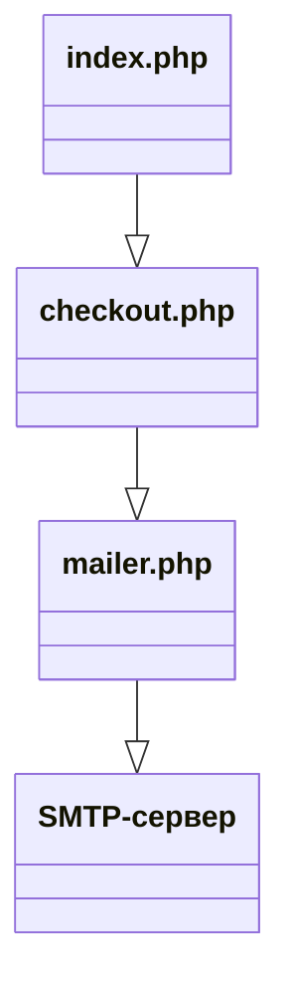

<div align="center">
  <a id="russian"></a>
  <h1>Скрипт php</h1>

  
  
  
  
  
</div>

  > **Author:** Alexandr Anatoliev

  > **GitHub:** [AlexandrAnatoliev](https://github.com/AlexandrAnatoliev)

---

<div align="center">
  <h2>Навигация</h2>
</div>

* [Техническое задание](#technical-specifications)
* [Общая архитектура](#architecture)
* [Требования к серверу](#requirements)
* [Установка PHPMailer](#PHPMailer-install)
* [Настройка почтового сервиса](#mail-service-setup)
* [Настройки товаров](#index-setting)
* [Переменные окружения](#env)

---

<div align="center">
  <a id="technical-specifications"></a>
  <h2>Техническое задание</h2>
</div>

```
Нужен скрипт калькулятора-заказа на php с радиокнопками, чекбоксами, 
картинками, полем ввода количества, расчётом итоговой суммы заказа 
и отправкой готового счета на оплату(в pdf или html с возможностью 
сохранения покупателем из письма в pdf) на почту покупателя и админа. 
Проведение онлайн оплаты не нужно, только отправка.
```

#### Реализовано:
* Страница заказа
<div align="center">
  
</div>
* Счет на оплату:
<div align="center">
  
</div>
* Сохранение в pdf-файл:
<div align="center">
  
</div>
* Отправка письма на почту покупателю:
<div align="center">
  
</div>

---

<div align="center">
  <a id="architecture"></a>
  <h2>Общая архитектура</h2>
</div>



---

<div align="center">
  <a id="requirements"></a>
  <h2>Требования к серверу</h2>
</div>

* PHP: версия 7.4 и выше
* Расширения PHP: openssl, sockets
* Composer: менеджер пакетов PHP
* Права доступа: возможность записи в папку проекта

<div align="center">
  <h3>Проверка установленных расширений</h3>
</div>

```
php -m | grep -E "openssl|sockets"
```

#### Ожидаемый вывод

```
openssl
sockets
```

<div align="center">
  <h3>Установка недостающих расширений</h3>
</div>

#### Ubuntu/Debian

```
sudo apt update
sudo apt install php-openssl php-sockets
sudo systemctl restart apache2
```

#### Windows (XAMPP)

Раскомментировать строки в `xampp\php\php.ini`:

```
extension=openssl
extension=sockets
```

---

<div align="center">
  <a id="PHPMailer-install"></a>
  <h2>Установка PHPMailer и phpdotenv</h2>
</div>

<div align="center">
  <h3>Установка Composer</h3>
</div>

#### Ubuntu/Debian

```
sudo apt update
sudo apt install composer -y
```

#### Windows (XAMPP)

Скачать установщик с **getcomposer.org**

<div align="center">
  <h3>Установка библиотек</h3>
</div>

#### Ubuntu/Debian

В корневой папке проекта выполнить:

```
composer require phpmailer/phpmailer
```

```
composer require vlucas/phpdotenv
```

После установки структура папок будет выглядеть:

```
/project/
├── checkout.php
├── configs/
│   ├── .env
│   ├── adminSettings.php
│   └── mail.php
├── img/
├── index.php
├── invoice.php
├── mailer.php
├── README.md
├── styles/
│   ├── checkout.css
│   └── index.css
└── vendor
    ├── phpmailer/
    └── autoload.php
```

---

<div align="center">
  <a id="mail-service-setup"></a>
  <h2>Настройка почтового сервиса</h2>
</div>

<div align="center">
  <h3>Gmail</h3>
</div>

#### Получение пароля приложения:
* Включить двухфакторную аутентификацию в Google-аккаунте:

```
Настройки → Безопасность → Двухфакторная аутентификация
```

* Создать пароль приложения:
  - myaccount.google.com/apppasswords
  - Приложение: Почта
  - Устройство: Другое (ввести "PHP Calculator")
  - Скопировать 16-значный пароль

#### Конфигурация Gmail SMTP:

| Параметр	          | Значение                              |
|---------------------|---------------------------------------|
| SMTP-сервер	        | smtp.gmail.com                        |
| Порт	              | 587 (TLS) или 465 (SSL)               |
| Шифрование	        | STARTTLS (для 587) или SSL (для 465)  |
| Лимит писем/день	  | 500                                   |

<div align="center">
  <h3>Яндекс Почта</h3>
</div>

#### Получение пароля приложения:

* Яндекс ID → Безопасность → Пароли приложений
* Создать пароль → Выбрать "Почта"
* Скопировать пароль

#### Конфигурация Яндекс SMTP:
| Параметр	          | Значение        |
|---------------------|-----------------|
| SMTP-сервер	        | smtp.yandex.ru  |
| Порт	              | 465 (SSL)       |
| Шифрование	        | SSL             |
| Лимит писем/день	  | 5000            |

<div align="center">
  <h3>Mail.ru</h3>
</div>

#### Получение пароля:

* Настройки → Безопасность → Пароли для внешних приложений
* Создать пароль
* Скопировать пароль

#### Конфигурация Mail.ru SMTP:

| Параметр	          | Значение      |
|---------------------|---------------|
| SMTP-сервер	        | smtp.mail.ru  |
| Порт	              | 465 (SSL)     |
| Шифрование	        | SSL           |

<div align="center">
  <h3>TimeWeb</h3>
</div>

В TimeWeb закрыты некоторые порты - открывать через тех.поддержку.
  
---

<div align="center">
  <a id="index-setting"></a>
  <h2>Настройки товаров</h2>
</div>

Добавление / удаление товаров, изменение цен, картинок производится редактированием 
соответствующих значений в массиве `items` в файле  `index.php`.

``` 
$items = [
  'standart' => ['name' => 'Тариф Стандарт', 'price' => 1000, 'img' => 'img/standart.jpg'],
  'pro'      => ['name' => 'Тариф Про', 'price' => 2500, 'img' => 'img/pro.jpg'],
  'vip'      => ['name' => 'Тариф VIP', 'price' => 5000, 'img' => 'img/vip.jpg'],
];
```

Картинки размещаются в папке `img/`

```
.
├── img
│  ├── backup.png
│  ├── calculate.png
│  ├── index.png
│  ├── phone-mail.jpg
│  ├── placeholder.jpg
│  ├── pro.jpg
│  ├── save-in-pdf.png
│  ├── seo.png
│  ├── standart.jpg
│  ├── support.png
│  └── vip.jpg
└── index.php
```

---

<div align="center">
  <a id="env"></a>
  <h2>Переменные окружения</h2>
</div>

Не храните пароли в коде. Используйте .env файлы:

```
# .env (не добавлять в Git!)
# ============================================
# НАСТРОЙКИ ПОЧТЫ (ОБЯЗАТЕЛЬНЫЕ)
# ============================================
MAILER_USERNAME=mycompany@gmail.com
MAILER_PASSWORD=abcd1234efgh5678

# ============================================
# НАСТРОЙКИ ПОЧТЫ (ОПЦИОНАЛЬНЫЕ)
# ============================================
# Если не указаны, используются значения по умолчанию для Gmail

MAILER_HOST=smtp.gmail.com
MAILER_PORT=587
MAILER_ENCRYPTION=tls
MAILER_CHARSET=UTF-8
```
