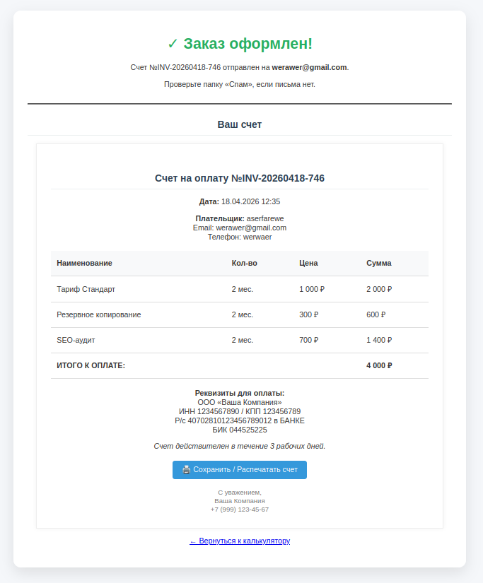
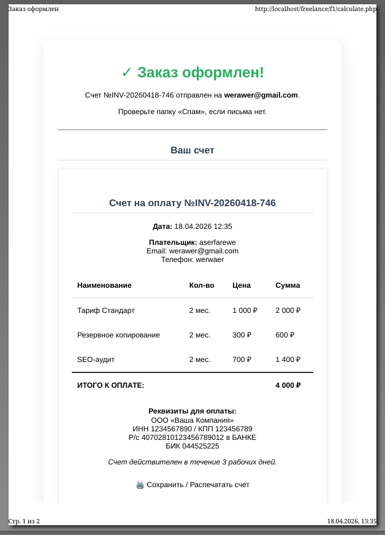

<div align="center">
  <a id="russian"></a>
  <h1>Скрипт php</h1>

  
  
  
  
  
</div>

  > **Author:** Alexandr Anatoliev

  > **GitHub:** [AlexandrAnatoliev](https://github.com/AlexandrAnatoliev)

---

<div align="center">
  <h2>Навигация</h2>
</div>

* [Техническое задание](#technical-specifications)

---

<div align="center">
  <a id="technical-specifications"></a>
  <h2>Техническое задание</h2>
</div>

```
Нужен скрипт калькулятора-заказа на php с радиокнопками, чекбоксами, 
картинками, полем ввода количества, расчётом итоговой суммы заказа 
и отправкой готового счетана оплату(в pdf или html с возможностью 
сохранения покупателем из письма в pdf) на почту покупателя и админа. 
Проведение онлайн оплаты не нужно, только отправка.
```

#### Реализовано:
* Страница заказа
<div align="center">
  
</div>
* Счет на оплату:
<div align="center">
  
</div>
* Сохранение в pdf-файл:
<div align="center">
  
</div>
* Отправка письма на почту покупателю:
<div align="center">
  
</div>

